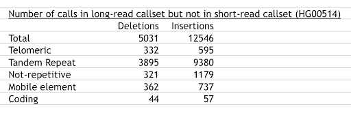

## Motivation 

Most SVs missed by short-read callers lie in tandem repeats: 



(based upon Supplementary Data 53 of [Chaisson et al 2019](https://pubmed.ncbi.nlm.nih.gov/30992455) and private communication with Mark Chaisson). 
This observation prompted us to revisit attempts to discover SVs in tandem repeats using short reads. 

## Scope 

As callers exist 
to capture SVs in tandem repeats where 
the repeat unit is smaller than 6bps,
known in the community as Short Tandem Repeats 
(STRs),
we designed `trfermikit` to pick up SVs that `manta` missed
in tandem repeats with repeat units 
larger than 6bps, known as 
Variable Number Tandem Repeats (VNTRs). 

## Impact 

We assessed the performance of `trfermikit` and `manta`, in both cases relative to a long-read benchmark callset, on VNTRs. 
The [results](experiments/minRepeatPeriod/evaluate.ipynb) show that `trfermikit` is more sensitive than `manta`. 

## How does it work?

`trfermikit` is based upon the [fermikit](https://pubmed.ncbi.nlm.nih.gov/26220959/) pipeline for deep Illumina resequencing data, which assembles reads into unitigs, maps them to the reference genome, and then calls variants from the alignment.

`trfermikit` biases the `minimap2` alignment step of the fermikit pipeline towards revealing deletions
by:
* increasing the reward for single-base matches
* increasing the penalty for single-base mismatches 
* decreasing the gap-open penalties (there are two because the cost function of gap length is piecewise linear)
* decreasing the gap-extension penalties 
This recovers a lot of events that a more stringent caller would throw out. 

Yet, some of those additional captured events are false discoveries. 
`trfermikit` mitigates this by throwing out calls that:
* are supported by "dirty" fermikit unitigs (essentially, those that have lots of small blocks when aligned to the reference or those whose mapping quality is zero)
* occur in “clusters”

## Quickstart

An example of how to use `trfermikit` can be found [here](experiments/minRepeatPeriod/run_trfermikit_and_evaluate_calls.sh). 

## Installation

```
git clone https://github.com/petermchale/trfermikit
cd trfermikit
bash install.sh 
conda activate trfermikit
```
Only installation on Linux x86_64 is currently supported.

## Usage 

Assuming that the path to this directory is 
`${root}`, usage is: 

```
PATH="${root}:$PATH"
trfermikit [OPTIONS] \
  --genome-build <"hg38" or "hg19"> \
  --output <path to results directory> \
  --reference <path to reference fasta (without the ".fa" suffix)> \
  --threads <number of threads> \
  --svtype <"DEL" or "INS"> \
  --alignments <path to short-read alignments (without the ".cram" suffix"; index assumed to be present)> 
```

Options are: 
| Key | Value | Description |
| --- | --- | --- |
--functional-regions | path to a set of regions (without the ".bed.gz" suffix) | Restrict examination to those tandem repeats that lie in these regions 
| --min-repeat-length | integer [default value: 0] | Only consider tandem repeats whose total number of bps is larger than this number 


## How fast is it?

If one confines the search to tandem repeats larger than 100bp in length,

```
trfermikit --min-repeat-length 100 ...
```

then the pipeline takes about 2 hours for a 70X genome.


## TODO

* Create a docker container and nextflow workflow (with nextflow processes for "make-regions", "make-calls" and "filter-calls") and register both at [dockstore](https://dockstore.org/).
* Make `--genome-build` and `--threads` optional

